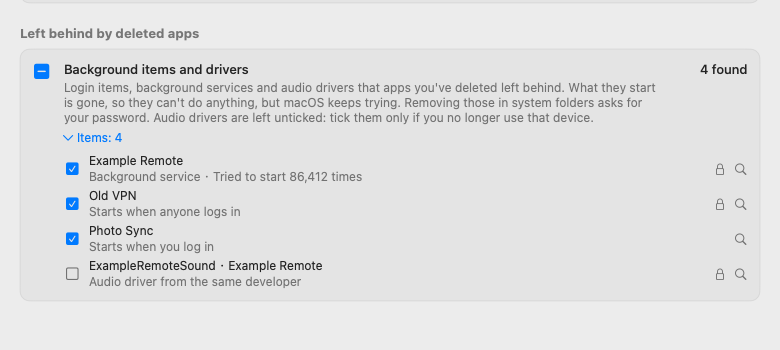
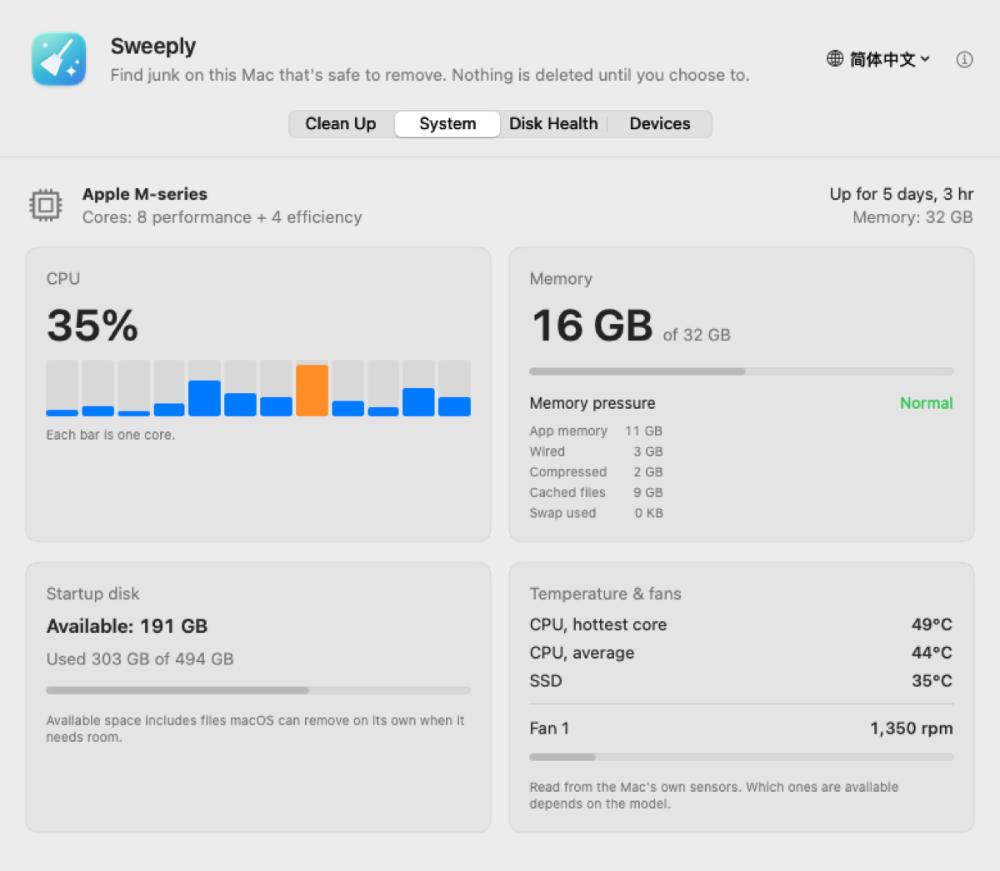
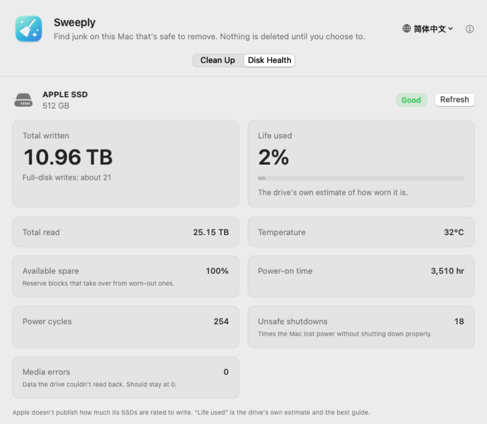

<p align="center"></p>

# Sweeply

**English** · [简体中文](README.zh-CN.md)

A small, honest junk cleaner for macOS. Sweeply finds caches, logs, developer leftovers
and what deleted apps left behind, shows you exactly what they are, and never deletes
anything until you choose to.

<p align="center">
  
</p>

> **Status: early preview (0.9).** Cleans up, removes what deleted apps left behind, gives your Mac a quick checkup, controls display brightness and the volume, and can stay in the menu bar.

## What it finds

**Developer tools**
- Xcode build data (DerivedData), Xcode caches, device support files, archives
- iOS Simulator caches
- Gradle caches (Android Studio)
- Homebrew downloads
- pip, npm, Yarn, CocoaPods and Swift Package Manager caches
- Xcode simulators (not selected by default)

**App caches & logs**
- Caches apps keep in `~/Library/Caches` (the system's own caches and those of running apps are skipped)
- Log files in `~/Library/Logs`
- Installers (.dmg, .pkg, .xip) in Downloads (not selected by default)

**Left behind by deleted apps**
- Login items and background services (launch agents and daemons) whose app is gone. What
  they start no longer exists, yet macOS keeps trying, sometimes every few seconds for weeks.
  Sweeply shows the app they came with and how many times macOS has tried.
- Audio drivers from the same developer, when none of its apps is installed any more (not
  selected by default).
- Removing those in system folders asks for your password, once, in macOS's own dialog.

<p align="center">
  
</p>

**System**
- CPU usage per core, memory and memory pressure, startup disk space, uptime
- CPU and SSD temperatures, fan speeds

<p align="center">
  
</p>

**Disk Health**
- How much has been written to your Mac's built-in SSD, how worn the drive thinks it
  is, its temperature, spare blocks and error counts — read straight from the drive.
- Writes per day over the last 30 days (Sweeply notes the total whenever it's open).
- Used space over the last 30 days and how much it changed, to spot something that keeps
  eating space. History is kept on this Mac only, across updates.

<p align="center">
  
</p>

**Devices**
- Displays, external drives, USB and Thunderbolt devices — names, sizes and speeds only.
- A brightness slider for each display (Apple displays, and most other monitors over DDC).
- A volume slider for the current sound output; it follows the volume keys, and the speaker
  icon mutes. Monitors that allow it over DDC get a slider for their own speakers too (the
  way [MonitorControl](https://github.com/MonitorControl/MonitorControl) does it).

**Menu bar** (optional, in Settings)
- Keep Sweeply running as a little broom in the menu bar, optionally with the CPU
  temperature or usage next to it, and open it at login. Its panel has the main readings and
  the brightness and volume sliders.

Each category explains what it is and whether it comes back. Expand it to see every
folder, reveal it in Finder, or untick the ones you want to keep.

## Safety first

- **Nothing is deleted without you.** Sweeply only scans until you pick what to clean.
- **Everything goes to the Trash**, so you can put it back until you empty it.
- **Only your Mac's own disk.** External drives are never scanned or touched.
- **System caches and running apps are left alone.**
- **Only what's certainly broken.** A background item counts as left over only when the
  program it starts is gone: not when macOS privacy protection keeps Sweeply from looking,
  not on an unplugged drive, and never Apple's own.
- **Checked twice.** Right before moving, each item is checked again: still in its
  category's folder, still on this Mac's disk, and its app still not running.
- **Works offline.** No accounts, no analytics, no network requests.
- **No identifiers on screen.** No serial numbers, hardware IDs or accounts, so
  screenshots are safe to share.

SSD health, temperatures, fan speeds and display brightness come from undocumented macOS interfaces (the
same ones open-source system monitors use). If a macOS update changes them, those parts
show "not available" instead.

## Languages

English, 简体中文, 繁體中文, 日本語, Русский, Español, हिन्दी — switch any time from the
globe menu in the window, no restart needed.

Translations other than English and Chinese would love a review from native speakers.
See [CONTRIBUTING.md](CONTRIBUTING.md).

## Install

1. Download `Sweeply-<version>.dmg` from [Releases](../../releases).
2. Open it and drag **Sweeply** into **Applications**.
3. The first time you open it, macOS says it can't verify the developer, because
   Sweeply isn't notarized by Apple yet. Open **System Settings → Privacy & Security**,
   scroll down and click **Open Anyway**. You only need to do this once.

Requires macOS 14 Sonoma or later, on Apple silicon or Intel.

## Build from source

Requires Xcode (the Command Line Tools alone lack SwiftUI's macro plugins).

```bash
./build.sh             # builds build.noindex/Sweeply.app (universal)
./build.sh --install   # also copies it to /Applications
./build.sh --dmg       # also makes a .dmg for a release
python3 tools/check_localizations.py   # checks every translation
```

`Sweeply.app/Contents/MacOS/Sweeply --report` prints every reading (system, sensors,
devices, disk health) twice, without any serial numbers — handy for bug reports.
`--disk-health` prints just the disk health reading. `Sweeply.app/Contents/MacOS/Sweeply --snapshot <folder>` renders the window in every
language, light and dark, using made-up results — handy for checking layouts and for
screenshots.

## Roadmap

- [x] Move selected items to the Trash (0.2)
- [ ] Remove simulators for iOS versions you no longer have installed
- [x] Old installers in Downloads (0.5)
- [x] Leftovers of deleted apps: background items and audio drivers (0.7)
- [x] App icon

## Support Sweeply

Sweeply is free and always will be. If it saved you some space, you can buy the
developer a coffee — WeChat Pay or Alipay in China, PayPal anywhere. Thank you!

<p align="center">
  
  
  
</p>

## Contact

Bugs and ideas: [open an issue](../../issues). Email: zhaoweijia1997@gmail.com

## License

[MIT](LICENSE)
