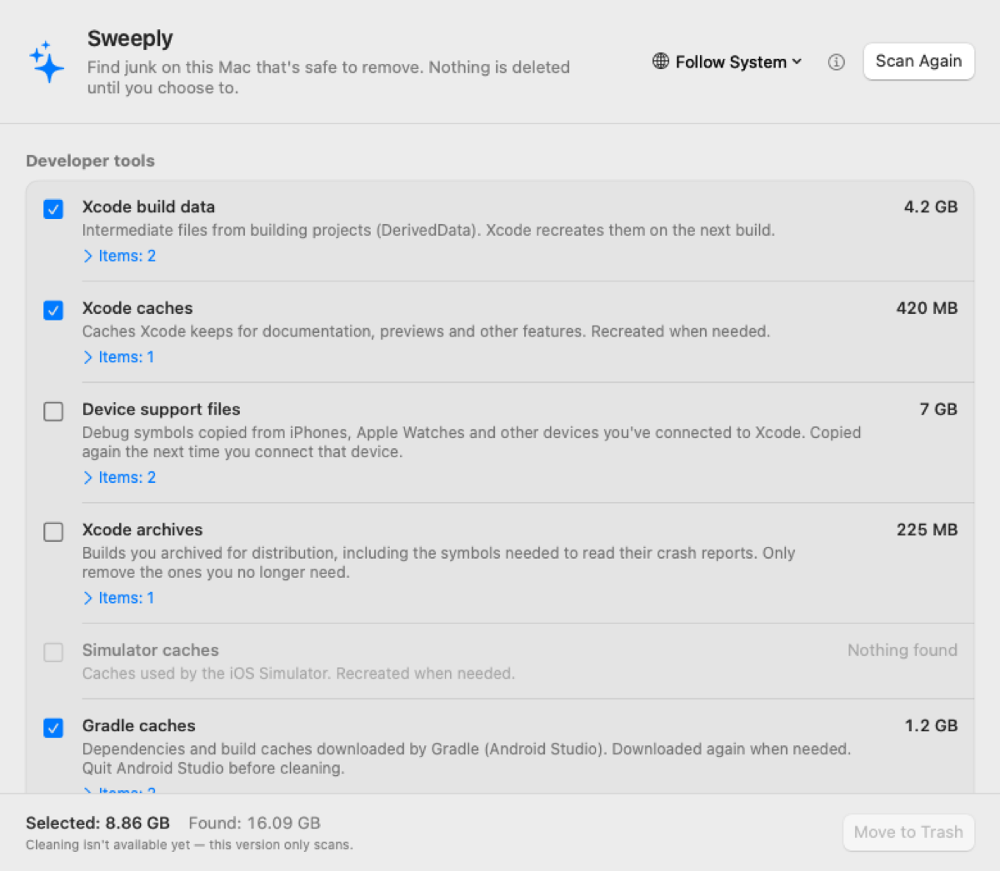

# Sweeply

**English** · [简体中文](README.zh-CN.md)

A small, honest junk cleaner for macOS. Sweeply finds caches, logs and developer
leftovers you can safely remove, shows you exactly what they are, and never deletes
anything until you choose to.

<p align="center">
  
</p>

> **Status: early preview (0.1).** This version scans and shows what it found.
> Moving items to the Trash comes in the next version.

## What it finds

**Developer tools**
- Xcode build data (DerivedData), Xcode caches, device support files, archives
- iOS Simulator caches
- Gradle caches (Android Studio)
- Homebrew downloads
- pip, npm, Yarn, CocoaPods and Swift Package Manager caches

**App caches & logs**
- Caches apps keep in `~/Library/Caches` (the system's own caches and those of running apps are skipped)
- Log files in `~/Library/Logs`

Each category explains what it is and whether it comes back, and you can expand it to
see every folder and reveal it in Finder.

## Safety first

- **Nothing is deleted without you.** Sweeply only scans until you pick what to clean.
- **Everything goes to the Trash**, so you can put it back. (Coming in 0.2.)
- **Only your Mac's own disk.** External drives are never scanned or touched.
- **System caches and running apps are left alone.**
- **Works offline.** No accounts, no analytics, no network requests.

## Languages

English, 简体中文, 繁體中文, 日本語, Русский, Español, हिन्दी — switch any time from the
globe menu in the window, no restart needed.

Translations other than English and Chinese would love a review from native speakers.
See [CONTRIBUTING.md](CONTRIBUTING.md).

## Install

1. Download `Sweeply-<version>.dmg` from [Releases](../../releases).
2. Open it and drag **Sweeply** into **Applications**.
3. The first time you open it, macOS says it can't verify the developer, because
   Sweeply isn't notarized by Apple yet. Open **System Settings → Privacy & Security**,
   scroll down and click **Open Anyway**. You only need to do this once.

Requires macOS 14 Sonoma or later, on Apple silicon or Intel.

## Build from source

Requires Xcode (the Command Line Tools alone lack SwiftUI's macro plugins).

```bash
./build.sh             # builds build.noindex/Sweeply.app (universal)
./build.sh --install   # also copies it to /Applications
./build.sh --dmg       # also makes a .dmg for a release
python3 tools/check_localizations.py   # checks every translation
```

`Sweeply.app/Contents/MacOS/Sweeply --snapshot <folder>` renders the window in every
language, light and dark, using made-up results — handy for checking layouts and for
screenshots.

## Roadmap

- [ ] Move selected items to the Trash (0.2)
- [ ] Remove simulators for iOS versions you no longer have installed
- [ ] Old installers in Downloads
- [ ] App icon

## Support Sweeply

Sweeply is free. If it saved you some space, you can buy the developer a coffee:
see [.github/donate](.github/donate).

<!-- Donation QR codes: uncomment once the images are in .github/donate/
<p>
  
  
  
</p>
-->

## Contact

Bugs and ideas: [open an issue](../../issues). Email: zhaoweijiaboy@gmail.com

## License

[MIT](LICENSE)
