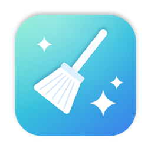
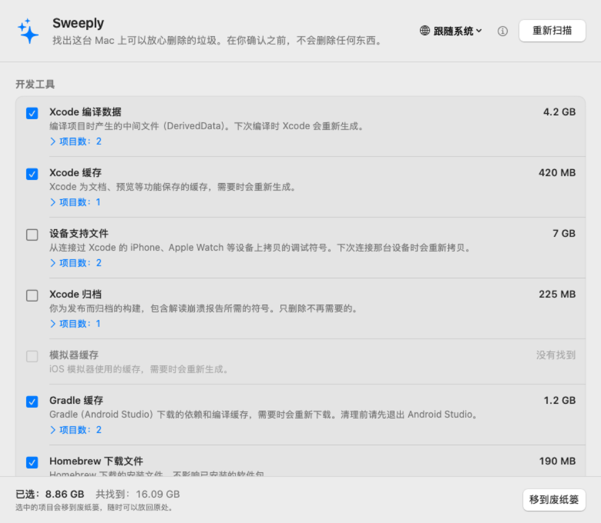
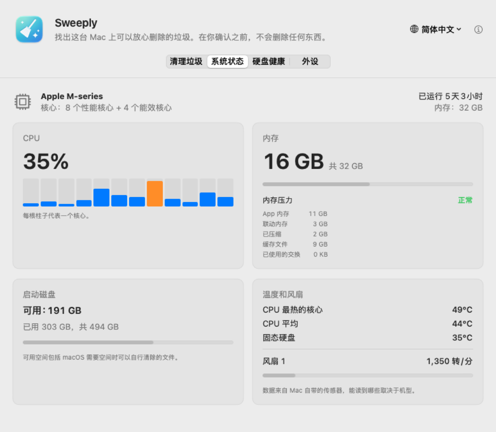
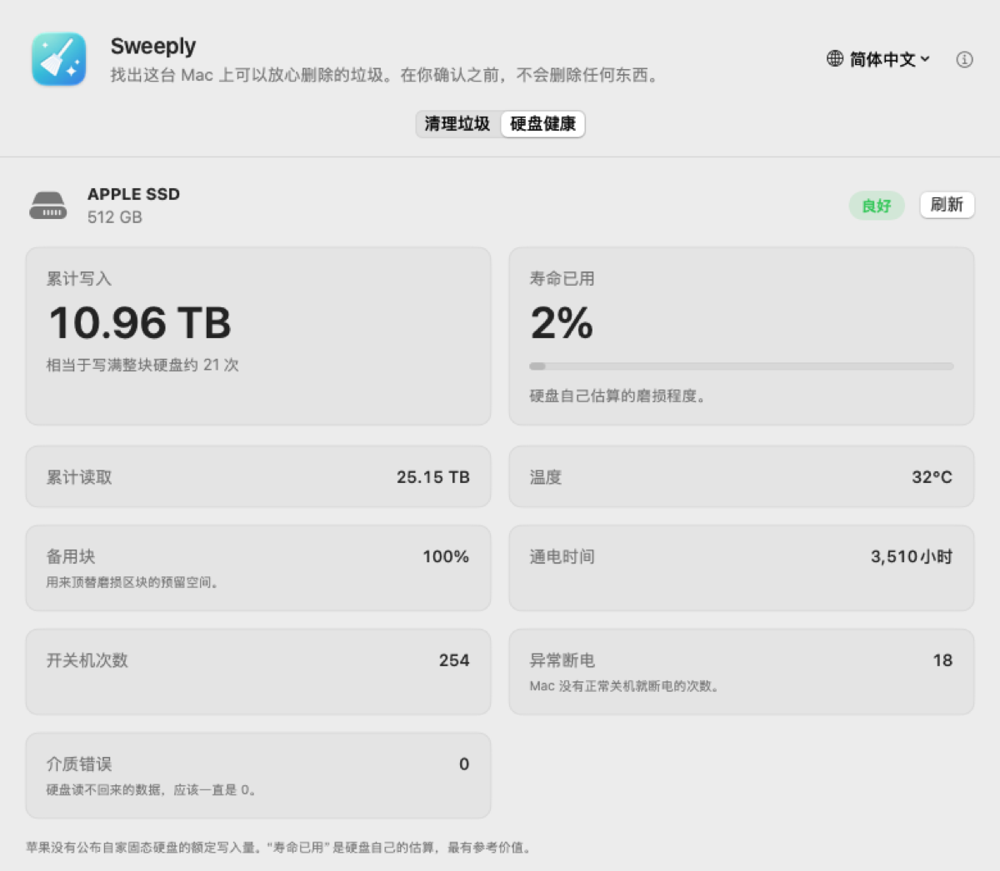

<p align="center"></p>

# Sweeply

[English](README.md) · **简体中文**

一款小巧、老实的 macOS 垃圾清理工具。Sweeply 帮你找出可以放心删除的缓存、日志和开发工具残留，
清楚告诉你它们是什么；在你确认之前，不会删除任何东西。

<p align="center">
  
</p>

> **状态：早期预览版（0.4）。** 清理垃圾，再给 Mac 做个快速体检：系统状态、硬盘健康、已连接的外设。

## 能找到什么

**开发工具**
- Xcode 编译数据（DerivedData）、Xcode 缓存、设备支持文件、归档
- iOS 模拟器缓存
- Gradle 缓存（Android Studio）
- Homebrew 下载文件
- pip、npm、Yarn、CocoaPods、Swift Package Manager 的缓存

**App 缓存和日志**
- `~/Library/Caches` 里各 App 的缓存（系统自己的缓存、正在运行的 App 的缓存会跳过）
- `~/Library/Logs` 里的日志

**系统状态**
- 每个 CPU 核心的占用、内存和内存压力、启动磁盘空间、开机时长
- CPU 和固态硬盘温度、风扇转速

<p align="center">
  
</p>

**硬盘健康**
- 这台 Mac 内置固态硬盘累计写入了多少、硬盘自己估算的磨损程度、温度、备用块和错误次数，直接从硬盘读取。
- 最近 30 天每天写入多少（Sweeply 每次打开时记下累计值）。

<p align="center">
  
</p>

**外设**
- 显示器、外接硬盘、USB 和雷雳设备，只显示名称、容量和速度。

每一类都会说明是什么、删了会不会自动重建。展开能看到每个文件夹，可以在访达中显示，也可以单独取消勾选想保留的。

## 安全第一

- **你不点头就不删。** 选好要清理的之前，Sweeply 只扫描。
- **一律移到废纸篓**，清空废纸篓之前都能放回原处。
- **只管 Mac 自己的磁盘。** 外接硬盘从不扫描、从不碰。
- **系统缓存和正在运行的 App 一概不动。**
- **移动前再核对一遍。** 每一项在移动前都会重新检查：还在它所属类别的文件夹里、还在这台 Mac 的磁盘上、对应的 App 没有在运行。
- **完全离线。** 没有账号，没有统计，不联网。
- **界面上不显示任何身份信息。** 没有序列号、硬件 ID 或账户，截图可以放心分享。

硬盘健康、温度和风扇转速用的是 macOS 未公开的接口（开源系统监控工具用的也是这些）。
如果哪次系统更新改了这些接口，对应的部分会显示“不支持”，不会出错。

## 语言

English、简体中文、繁體中文、日本語、Русский、Español、हिन्दी。在窗口里的地球图标菜单随时切换，
不用重启。

除中英文外的翻译欢迎母语者帮忙校对，见 [CONTRIBUTING.md](CONTRIBUTING.md)。

## 安装

1. 在 [Releases](../../releases) 下载 `Sweeply-<版本号>.dmg`。
2. 打开后把 **Sweeply** 拖进 **应用程序**。
3. 第一次打开时，macOS 会提示“无法验证开发者”，因为 Sweeply 还没有经过苹果公证。
   打开 **系统设置 → 隐私与安全性**，往下翻，点 **仍要打开**。只需要做一次。

需要 macOS 14 Sonoma 或更新版本，Apple 芯片和 Intel 都支持。

## 从源代码编译

需要安装 Xcode（只装命令行工具不行，缺少 SwiftUI 的宏插件）。

```bash
./build.sh             # 生成 build.noindex/Sweeply.app（通用版）
./build.sh --install   # 再装到“应用程序”
./build.sh --dmg       # 再打一个发布用的 .dmg
python3 tools/check_localizations.py   # 检查所有翻译
```

`Sweeply.app/Contents/MacOS/Sweeply --report` 会把所有读数（系统、传感器、外设、硬盘健康）打印两遍，不含任何序列号，提交问题时附上它很有用。
`--disk-health` 只打印硬盘健康的读数。
`Sweeply.app/Contents/MacOS/Sweeply --snapshot <文件夹>` 会用虚构的扫描结果，把窗口在每种语言、
浅色和深色下各画一张图，方便检查排版和做截图。

## 计划

- [x] 把选中的项目移到废纸篓（0.2）
- [ ] 删除已不再安装的 iOS 版本对应的模拟器
- [ ] 下载文件夹里的旧安装包
- [x] App 图标

## 支持 Sweeply

Sweeply 永久免费。如果它帮你腾出了空间，可以请开发者喝杯咖啡：国内用微信或支付宝，海外用 PayPal。谢谢！

<p align="center">
  
  
  
</p>

## 联系

问题和建议：[提交 Issue](../../issues)。邮箱：zhaoweijia1997@gmail.com

## 许可证

[MIT](LICENSE)
